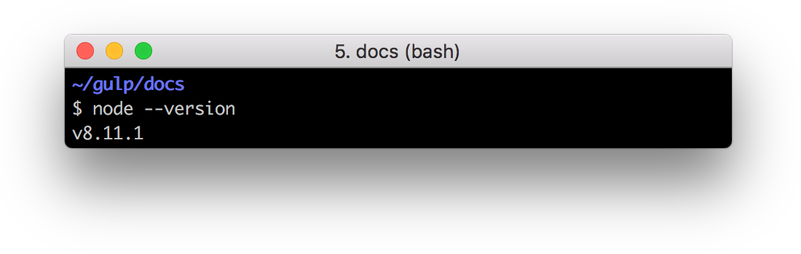

# Local A-Frame boilerplate

## ToDo's

- [ ] index.js
  - [ ] bundle.js
- [ ] index.html
  - [ ] Aframe module
- [ ] Readme retouch
- [ ] aframe-watcher
  - [ ] auto inject
  - [x] npm script for aframe-watcher
  - [x] not global
- [ ] gulp
  - [ ] npm script for gulp
  - [ ] Clean up ?!
  - [ ] optimize images
  - [x] not global
- [ ] package.json
  - [ ] npm scripts
  - [ ] dependencies
  - [ ] description
  - [ ] meta
- [ ] usr test

## How to use

### 1. Erstelle eine Kopie auf deinem eigen Recher

Ihr könnt euch, entweder dass Rio klonen.

```bash
git clone git@github.com:Disc0erg0sum/a-farme-boilerplate.git
```

Oder eine ZIP herunterladen und diese entpacken.


### 2. Install dependencies

Stell sicher das du [node](https://wikiless.org/wiki/Node.js?lang=en) und [npm](<https://wikiless.org/wiki/Npm_(software)?lang=en>), dazu öffne ein Terminal und gebe folgendes ein.

```bash
node --version
```


und

```bash
npm --version
```


Öffne ein Terminal und get in den Order von der Boilerplate

```bash
cd der/pfad/zur/a-farme-boilerplate
```

dann

```bash
npm install
```

Herzlichen Gluekwunsch du hast es geschaft! :)

### 3. How to develop

Der Ort, in dem du vorrangig entwickelst, ist Vorrang `der/pfad/zur/a-farme-boilerplate/src`. Hier müsse deine `index.html` und alle anderen Assets liegen. Du kannst beliebig unter oder erstellen.

Öffne die in `index.html` in dem Editor deiner Wahl. Ich empfehle VSCode oder Sublime.

Öffne ein Terminal und gehe in den Order von der Boilerplate

```bash
cd der/pfad/zur/a-farme-boilerplate
```

und dann

```bash
gulp
```

Öffne ein zweites Terminal und gehe in den Order von der Boilerplate

```bash
npm run inspect
```

---

So, jetzt wird es spannen!

Inzwischen sollte sich ein Browserfenster geöffnet haben, der dir eine Warnung anzeigt. Das dieses Zertifikat nicht sicher ist blala, akzeptiert die unsicherst! :)

Wenn ihr jetzt etwas in eurer index.html ändert und speichert, reloaded der Browser.

---

Jetzt wird es noch spannder... ;)
Gebt der Box in der index.html eine ID und sichert. Es können nur Objekte gesichert werden, die eine eindeutige ID haben.

```html
<a-box id="box" position="-1 0.5 -3" rotation="0 45 0" color="#4CC3D9"></a-box>
```

Geh wider in den Browse und öffnet den A-Frame Inspektor. `ctrl + alt + i`
Wähle die Box aus und veränder einen beliebigen Parameter und drucke speichern.


Jetzt musst du noch in den Terminal schauen, wo du
`aframe-watcher src/index.html` ausfuhrst und y drücken.

Noch ein Tipp zum Schluss rücke mal `h`, wenn du den Inspektor geöffnet hast.
